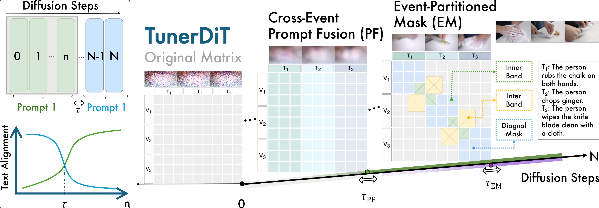

# TunerDiT: Training-free Progressive Steering of Diffusion Transformer for Consistent Multi-Event Video Generation

[](https://tunerdit.github.io)
[](https://arxiv.org/abs/2605.31590)

This repository contains the official codebase and website assets for **TunerDiT**.

> **TunerDiT: Training-free Progressive Steering of Diffusion Transformer for Consistent Multi-Event Video Generation**  
> Ruotong Liao<sup>1,3*</sup>, Guowen Huang<sup>2*</sup>, Qing Cheng<sup>2</sup>, Guangyao Zhai<sup>2</sup>, Lei Zhang<sup>4</sup>, Xun Xiao<sup>5</sup>, Thomas Seidl<sup>1,3</sup>, Daniel Cremers<sup>2,3</sup>, Volker Tresp<sup>1,3</sup>  
> <sup>1</sup>Ludwig Maximilian University of Munich, <sup>2</sup>Technical University of Munich, <sup>3</sup>MCML, <sup>4</sup>University of Hamburg, <sup>5</sup>Huawei European Research Institute  
> <sup>*</sup>Equal contribution

---

## 📌 Abstract

Text-to-video (T2V) generation faces challenging questions when generating videos with long horizons containing multiple events. Inspired by the intrinsics of the diffusion process, we probe video diffusion transformers (DiTs) and uncover intrinsic turning points in the DiT denoising trajectory where conditioning text affects generation from global layout to fine-grained details. Building on this finding, we present **TunerDiT**, a simple yet effective progressive steering method that requires no additional training for multi-event generation. TunerDiT comprises two steering handles: (1) **Event-Partitioned Masking** that enforces event boundaries while allowing cross-event transition bands; (2) **Cross-Event Prompt Fusion** that injects neighboring event semantics for late-stage refinement. We contribute a self-curated prompt suite for benchmarking multi-event generation, i.e. **MEve**. TunerDiT achieves state-of-the-art performance across 8 metrics and offers a tunable trade-off between video consistency and event separation, compared with other training-free methods. The improvement in text alignment increases with the event count, indicating a scaling possibility with increasing event count.

---

## 🛠️ Method Overview

TunerDiT is a progressive coarse-to-fine steering framework for multi-event T2V generation that operates without training. It exploits intrinsic turning points in the DiT denoising process by intervening at the appropriate phase to first generate a shared layout of multiple events and refine inner event details at a certain later stage, utilizing two steering handles activated according to a schedule:

1. **Cross-Event Prompt Fusion (PF):** A gating scheme that conditions video latents on event prompts to enhance semantic awareness and coherence.
2. **Event-Partitioned Mask (EM):** A diagonal mask that isolates events with connecting bands across events on DiT attention layers. The mask design restrains DiT’s attention to enforce event boundaries and ensure smooth handovers.

<p align="center">
  
</p>

---

## ✉️ Citation

If you find our work, dataset, or code useful for your research, please consider citing our paper:
```bibtex
@misc{liao2026tunerdittrainingfreeprogressivesteering,
      title={TunerDiT: Training-free Progressive Steering of Diffusion Transformer for Consistent Multi-Event Video Generation}, 
      author={Ruotong Liao and Guowen Huang and Qing Cheng and Guangyao Zhai and Lei Zhang and Xun Xiao and Thomas Seidl and Daniel Cremers and Volker Tresp},
      year={2026},
      eprint={2605.31590},
      archivePrefix={arXiv},
      primaryClass={cs.CV},
      url={https://arxiv.org/abs/2605.31590}, 
}
```

---

## 🪪 License and Acknowledgements
- The code and website assets are licensed under a [Creative Commons Attribution-ShareAlike 4.0 International License](http://creativecommons.org/licenses/by-sa/4.0/).
- The structure of this website template is borrowed from [Nerfies](https://github.com/nerfies/nerfies.github.io). We thank the authors for their open-source contribution.
```